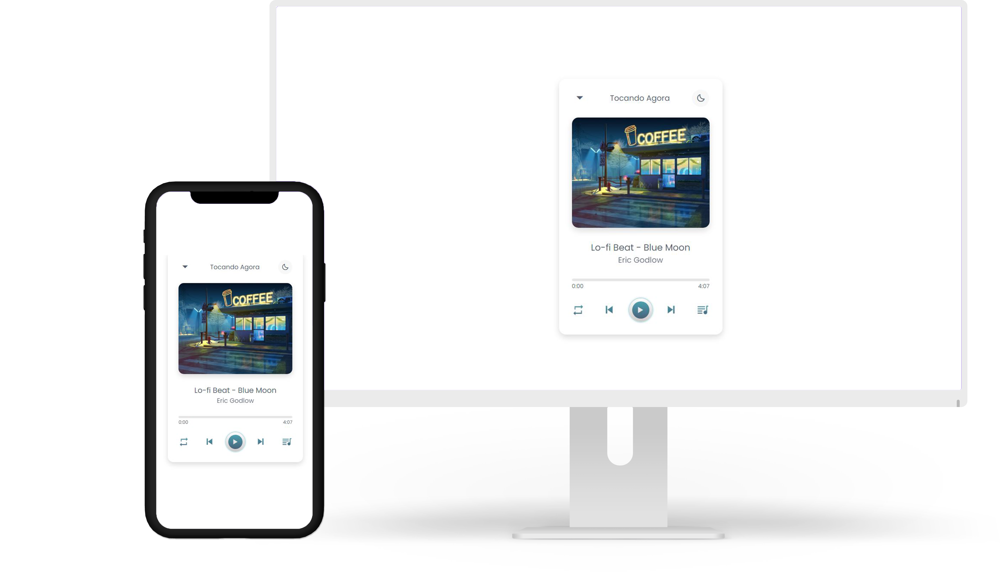
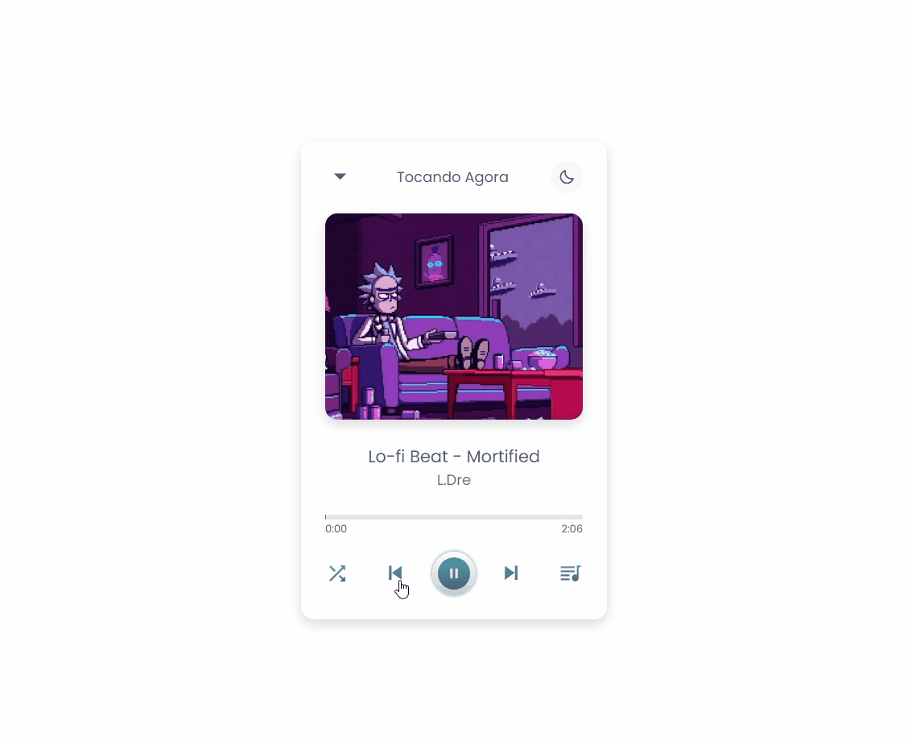
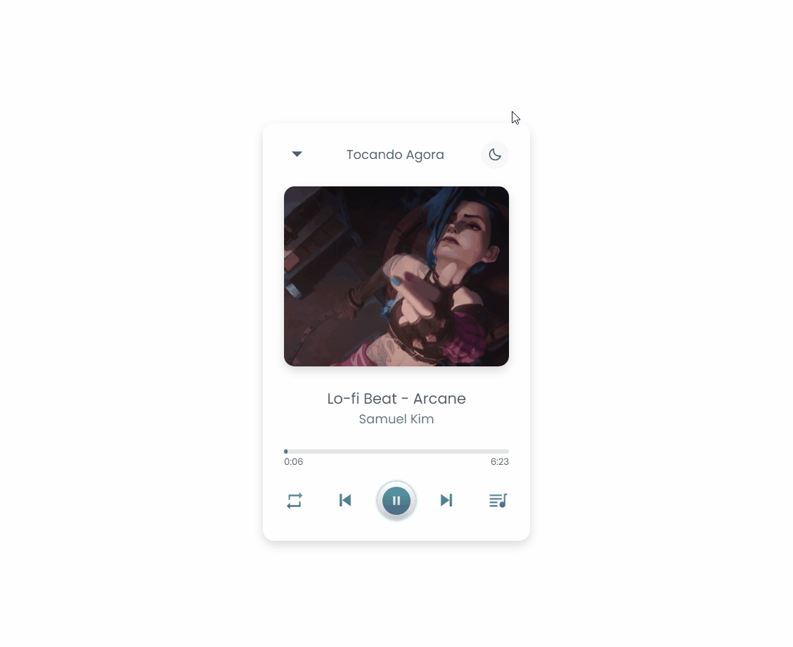
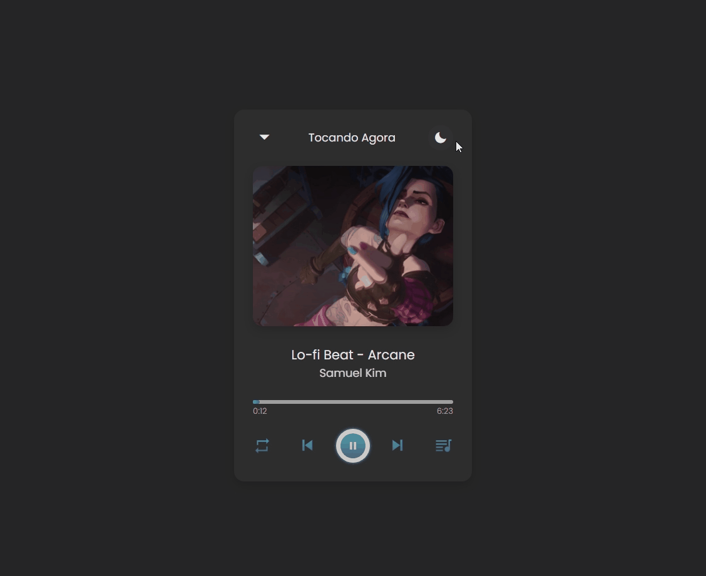
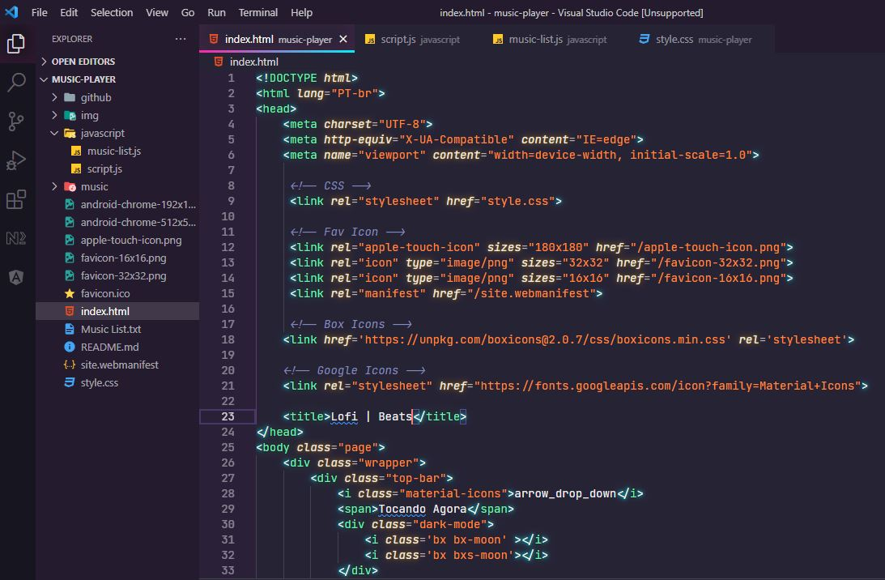

<h1 align="center">
    
</h1>

    <h3> 🎧 Precisa de um Lo-Fi para estudar? Cola aí! 🎧 </h3>
    
    
     
    

## Lofi - Beats

Desafio proposto pelo Igor do curso Programador BR com o intuito de elaborar um player de música utilizando JavaScript. Através de uma das aulas do curso, resolvi me aprofundar mais e seguir o tutorial do canal CodingNepal que adicionou diversas funcionalidades ao player, como os modos: aleatório e repetir.  Por fim, coloquei um modo dark para os amantes do tema.

  

## 🛠️ Tecnologias

💻 HTML

💻 CSS

💻 JavaScript

## :camera: Veja:

### 🖥️ Desktop

### ☑️ Código:

## 🔖 Layout

Você pode visualizar o layout do projeto através [desse link](https://www.youtube.com/watch?v=1-CvPn4AbT4&ab_channel=CodingNepal). E acessar o canal aqui: [CodingNepal](https://www.youtube.com/channel/UCk7xIEmd3MeyhIu2StLX5yA).

## 🌟 Curso Desenvolvimento Web Full Stack

Deixo minha recomendação ao curso do **IGOR OLIVEIRA**. Tenho aprendido muito nesses últimos meses e o curso tem sido fundamental para o meu aprendizado.

